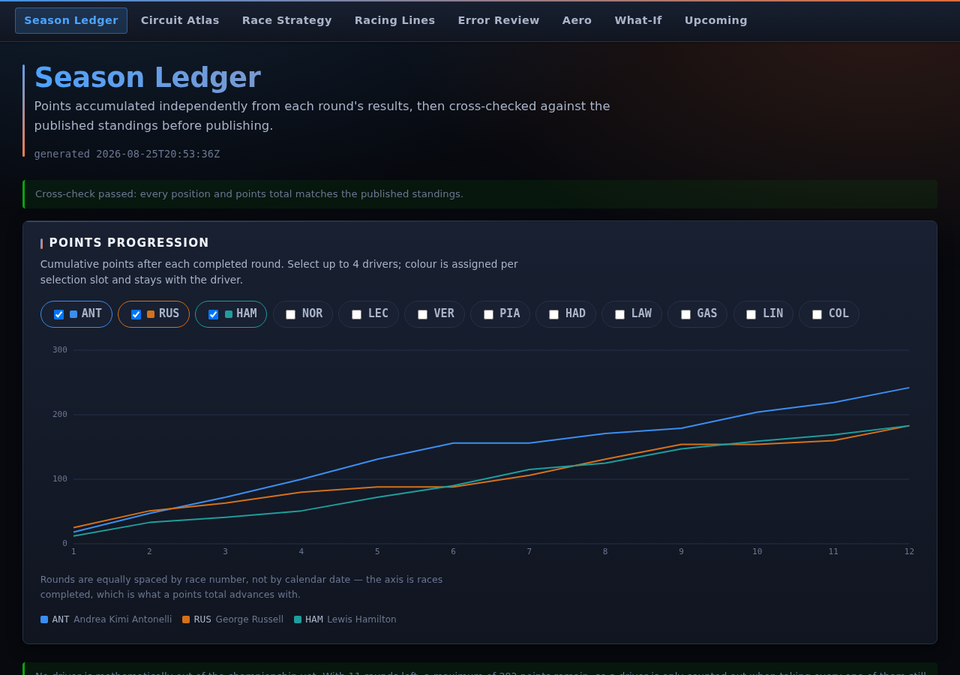
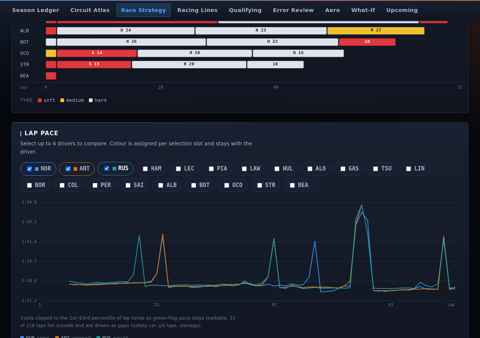
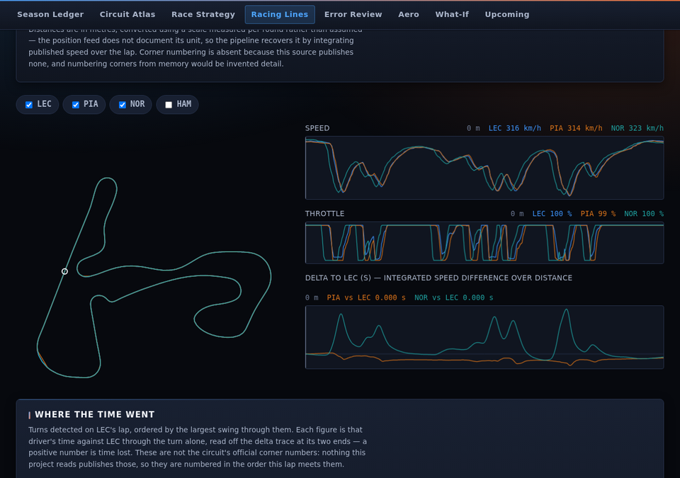
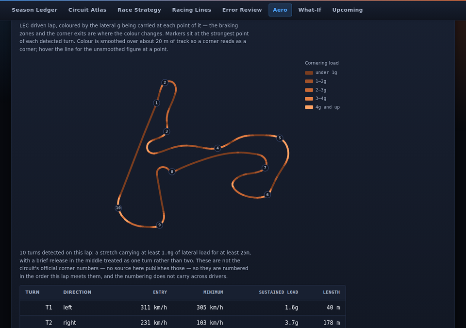
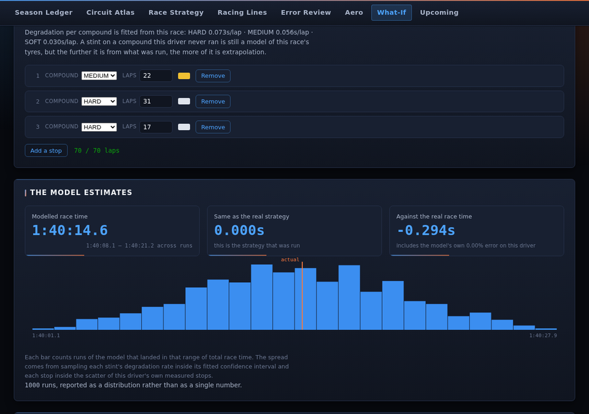
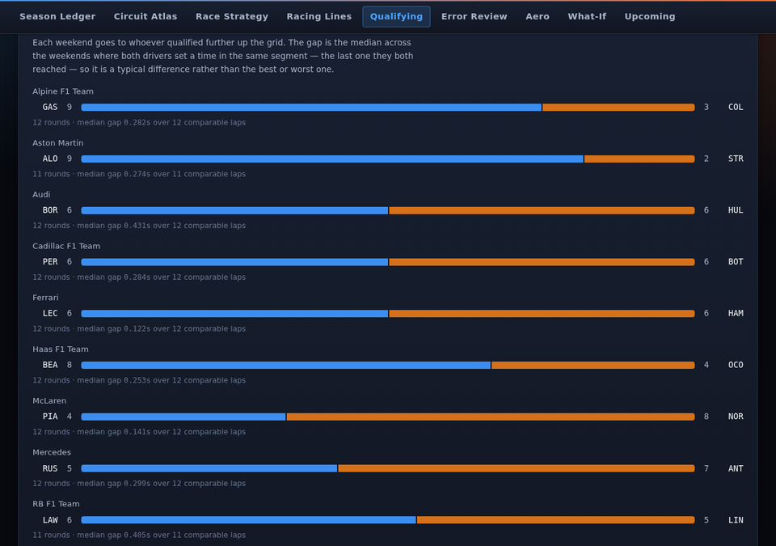
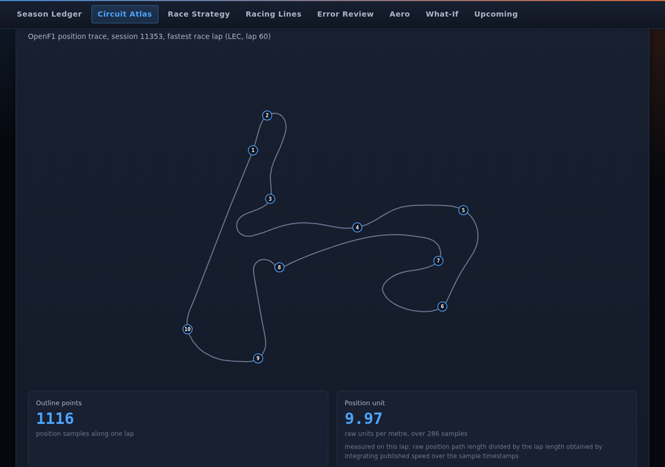

# F1 2026 Race Intelligence

**Live site:** https://devendrap7.github.io/F1-LAB/

An unofficial, non-commercial, open-source F1 2026 race-analysis site:
standings, race strategy, and — where the data allows — circuit atlases,
racing-line comparisons and aerodynamic analysis. Built as a static site
for GitHub Pages, with every figure computed at build time from public
data and nothing estimated to fill a gap.

See `DISCLAIMER.md` and `docs/SPEC.md` (full architecture and module
spec) before contributing.

## What is live

The site opens on a front page that states the rules it is built under
and counts what it has — rounds ingested, sessions with racing lines,
counterfactuals published, figures withheld — read from the artifacts at
load time rather than written into the copy.





- **Season Ledger** — the 2026 championship, accumulated independently
  from each round's results and cross-checked against the published
  standings. The cross-check result is shown either way; a mismatch is a
  hard failure that blocks publication, not a warning to read past.
- **Race Strategy** — twelve races of real lap times (14,066 laps), with
  a stint chart, a lap-pace comparison for up to four drivers, an
  undercut ledger, and per-stint pace-trend fits.
  The ledger also carries a points-progression chart and a
  mathematical-elimination calculator, the latter on the most
  conservative bound available: a driver is counted out only when
  maximum points from every remaining round still leaves them short of
  the leader's current total.
- **Upcoming** — a brief for the next round, built only from past
  editions of the same circuit: finish rate, places moved from the grid,
  the winner's grid slot and stops per driver, each shown with the
  sample it came from. It is a record, not a forecast, and the page
  leads with that — 2026 is a regulation reset, so the cars behind those
  numbers are not the cars about to race.
- **Circuit Atlas** — the verified calendar, plus track outlines traced
  from real position telemetry. Each outline is one measured lap's
  driven path, so it follows the racing line rather than the centre
  line, and it says so. Turns are detected from that lap and described
  with entry and minimum speed, gear at the apex and braking point; they
  are numbered in lap order, not by the circuit's official numbering,
  which no source here publishes. Elevation is drawn where the feed's own
  z channel is really elevation — Spa measures 102 m of climb, and a
  circuit whose z does not vary gets the reason instead of a flat line.
- **Racing Lines** — per-driver fastest laps from qualifying or the race,
  decoded from Int16 position binaries, with linked speed and throttle
  traces on a shared distance axis, the line colourable by any published
  channel, a turn-by-turn table of where the delta was made, and a
  mini-sector dominance map showing which pieces of the circuit each
  driver owned. The position unit is measured per round, not assumed.
- **Driver Error Review** — race-control messages quoted verbatim and
  attributed by the published car number, kept strictly separate from
  this project's own observation that a lap ran slower than the same
  driver's green-flag median. A flag is not a verdict, and the page is
  built so the two can never be read as the same thing.
- **Refusals** — the ledger of everything computed and then withheld:
  327 figures this season, each with the number that made the decision.
  A dashboard that cannot say no fills every gap with something
  plausible, and a reader has no way to tell which numbers those are.
- **Driving Style** — how a lap was driven rather than how quick it was:
  share of the lap at full throttle, on the brakes, and coasting; how far
  past each apex the throttle comes back; the speed carried through the
  slowest point of each turn; gear changes. There is no "better" column,
  because carrying more speed into a corner is not superior to braking
  later and turning tighter. It also compares the same driver's
  qualifying lap against their fastest race lap, and says which twelfth
  of the circuit the difference was paid in.
- **Aero Explainer** — lateral and longitudinal acceleration for a
  driver's fastest lap, computed from the published racing line: a g-g
  diagram, the lateral g the car sustained at each speed, the driven lap
  coloured by the load it was carrying, and each detected turn with its
  entry speed, minimum speed and sustained load. Turns are numbered in
  the order this lap meets them, which is not the circuit's official
  corner numbering — no source here publishes that. No downforce figure
  either, because that needs constants none of them publish.
- **Sprint Weekends** — the second race of a sprint weekend, which the
  rest of the site does not show: the same drivers, cars and circuit,
  racing twice from two different grids inside a day. Places changed
  between grid and flag for each race, stated as places and not as
  overtakes, with the lap counts beside them rather than divided into
  them; and Spearman's rho between the two finishing orders, per round,
  withheld below five drivers classified in both. A driver counts as
  having raced if the feed calls them Finished or Lapped — the first
  version of that rule missed "Lapped", threw away fifty-one rows, and
  passed every test, so the gate now re-decides it from each published
  row rather than trusting the flag stored beside it.
- **What-If Engine** — replay a race with a different strategy, on
  parameters fitted to that race and only for drivers whose real race
  the model reproduces within 1%. It estimates a race time and says
  nothing about finishing position.

Every page that is about one race weekend keeps that selection in the
URL — `#/lines?round=12&session=Q` opens on round 12's qualifying lines —
and ends with links to the other pages carrying the same round across, so
a question that starts on the strategy board can be followed to the
racing line, the counterfactual and the circuit without re-picking the
round four times. A link whose target has nothing to carry is left out
rather than shown, because landing on another page's default is the thing
the links exist to stop.

Race Strategy — stints coloured by the real compound, with the undercut
ledger and per-stint pace fits below:



Racing Lines — overlaid driven laps, colourable by any published channel,
with a turn-by-turn account of where the delta was made and a mini-sector
map of who owned which piece of circuit:



The Aero Explainer — the driven lap coloured by cornering load, with each
detected turn numbered and described:



The What-If engine — replay the race on a different strategy, on
parameters fitted to that race:



Qualifying — team-mate head to head, a count of weekends with its sample
beside it:



The Circuit Atlas — an outline traced from a real lap, with detected
turns:



## Where the data comes from

Three public sources, none of them official.

**Jolpica-F1** (the Ergast successor) serves the schedule, entry list,
results, standings, lap times and pit stops — the whole championship
side of the site, plus the historical priors behind the Upcoming brief.

**OpenF1** serves car position (x/y/z), car telemetry (speed, throttle,
brake, gear, DRS, rpm), stints with tyre compounds, race-control flags
including safety cars, and intervals. The track outlines and racing
lines are built from it.

**The Formula 1 live-timing service** returns **HTTP 403 to every
request from a datacenter IP**, including its own root and a
prior-season control, so this is the network origin being refused rather
than anything specific to this season. FastF1 depends on it and is
therefore unavailable here.

That last finding is measured, not assumed — `pipeline/diagnose_sources.py`
probes every endpoint and prints status codes; run it via the "Diagnose
data sources" workflow.

### A correction worth recording

For most of this project's life that 403 was documented here as the
reason four modules shipped permanently empty. That was an overreach.
The 403 establishes that *one host* refuses this network; it says
nothing about whether the underlying data is obtainable elsewhere, and
nobody had checked. OpenF1 answers 200 from the same runners and carries
the same channels, so Racing Lines and Circuit Atlas geometry are now
built from real position traces.

The lesson is kept in the repo rather than quietly edited away: a
measurement ("this host refuses us") and a conclusion ("this data cannot
be had") are different claims, and the gap between them cost this
project four modules.

## Model limitations

Every figure the site derives carries its own caveat in the UI; the
substantive ones:

- **Per-stint pace trend is not a degradation rate.** Within one stint,
  fuel burn and tyre degradation are both close to linear in lap number
  and are not separately identifiable from lap times alone. The published
  slope is their sum plus track evolution, flagged `fuel_corrected:
  false`. A negative slope (the driver getting faster) is normal and is
  not evidence about tyres.
- **A fit is only called usable when it earns it.** Reliability requires
  both a sample-count floor and an R² floor. On real race data 57% of
  fits clear both; the rest are published with the reason they failed
  ("R² 0.06 below 0.3 — lap-to-lap scatter dominates any trend in this
  stint") rather than shown as a confident number.
- **Tyre compounds are matched, never assumed.** Jolpica-F1 publishes
  none; OpenF1's stint feed does, and a stint takes a compound only when
  it matches by driver code and lap overlap above a set share. Eleven of
  the twelve races run so far are fully matched. A stint that cannot be
  matched keeps the ordinal shading and says so, because a wrong compound
  colour is worse than no compound colour.
- **Undercuts measure what happened, not what would have happened.**
  Gaps come from elapsed race time (the running sum of lap times).
  Pairings are excluded when the window cannot be about the stop — the
  rival stayed out beyond ten laps, either car stopped again inside it,
  lap data is missing, or the swing exceeds four pit losses — and the
  exclusion counts are shown alongside the table. Windows where the field
  was slowed are flagged rather than deleted, since without a
  track-status channel a neutralised period can only be suspected.
- **Qualifying is preferred where it exists.** The atlas draws one
  outline per circuit and a qualifying lap is the better one to draw it
  from — low fuel, fresh tyres, closest to the limit of the track — so a
  qualifying trace replaces a race one and a race trace never overwrites
  a qualifying one. It also filled the two real gaps: Monaco and the
  Hungaroring had no outline at all, because their race position feeds
  are unusable, and both now have one from qualifying. All twelve rounds
  have qualifying lines; ten have race lines as well.
- **Two of the twelve races have no racing line, and say why.** The
  position feed returns nothing at all for Monaco — zero location rows
  for every driver's fastest lap, while car data for the same window
  returns about 285 — and at the Hungaroring it repeats coordinates so
  hard that 322 samples contain roughly 30 distinct positions, one per
  150 m of a 4.4 km lap. Both rounds carry a manifest stating the
  per-driver counts, because "the source has nothing usable" and "the
  backfill has not run yet" are different facts and only one of them
  will change on its own.
- **Elevation is published only where it is real.** The position feed
  carries a z channel that is documented nowhere and flat at some
  circuits, so the pipeline judges it per round: under 3 m of variation
  over a whole lap is a constant with noise on it, not a profile. The
  measured range is published either way, so a refusal can be checked.
- **No DRS zones.** The feed carries a DRS channel, but turning its
  integer codes into "the flap was open here" needs a mapping this
  project has no verified source for — the same rule that keeps corner
  numbers out.
- **Curvature is fitted, not differentiated.** Position arrives at about
  3.7 Hz, over 20 m between fixes at racing speed, so a curve is fitted to
  a window of the path that always spans several real fixes. A 2 m finite
  difference on the same laps read 18-24g lateral — it was measuring the
  interpolation between fixes, not the corner. Headline g figures are
  99th percentiles rather than maxima for the same reason.
- **No track-status channel at all**, so safety-car and traffic laps are
  excluded from fits by an outlier rule rather than by flag.
- **The Upcoming brief's priors are weak by construction.** They come
  from at most four past editions of one circuit, under a different set
  of technical regulations, and every figure is rendered with its sample
  count for that reason. Classification keys off `positionText`, not the
  status text: the same lapped-but-classified finisher reads `+1 Lap` in
  2022 and `Lapped` in 2025, so matching on status would have counted
  every lapped 2025 finisher as a retirement.

## The What-If engine, and the gate it had to clear

The model itself (`pipeline/models/whatif.py`, ported line-for-line to
`src/lib/whatifModel.js` and pinned by a two-sided parity test) existed
for months with no numbers in it. What it needed was parameters fitted to
a real race, and a demonstration that those parameters reproduce that
race — the spec makes that a publish gate, not a nice-to-have.

`pipeline/models/whatif_fit.py` fits them from the lap data already
ingested:

- **One fit per race, across the whole field**, not per driver. Within a
  stint, tyre life counts up by one exactly as laps remaining counts
  down by one, so their sum is a constant the stint's intercept absorbs:
  fitted driver by driver the design matrix is rank deficient, and every
  single-stop race in this season came back unfittable. Across the field
  it is identifiable, because different drivers ran the same compound
  over different parts of the race. Pace stays a per-driver term; fuel
  burn and compound degradation are shared, which is also what they
  physically are.
- **Fuel and track evolution are not separated.** Both are linear in lap
  number and one race cannot tell them apart, so the whole coefficient
  is published as fuel and the evolution rate is zero rather than
  guessed.
- **Pit loss, the standing-start loss and the cost of a neutralised lap
  are measured, not fitted** — each is the excess of specific laps over
  what the fit says they should have taken.
- **Red-flagged races are refused.** A suspension leaves the cars
  stationary with the clock running (round 12 carries a 1758-second lap
  3), the model has no term for that, and a race total containing one is
  not a quantity it can be checked against. Four of this season's twelve
  races are excluded for this, each with the lap time that caused it on
  record.

The gate then runs per driver: replay their real strategy, compare the
model's median against their real race time, and offer a counterfactual
only if it lands within 1%. Eighty-one driver-races across eight rounds
clear it. Drivers who do not clear it are published anyway, with their
error, because "the model does not describe this race" is the useful
fact about them. `pipeline/validate_export.py` re-simulates every
published case from its exported parameters on each run, so a drift in
the model or the export fails the build rather than reaching the site.

The page never computes a finishing position, because it has no rivals
and no traffic model. It reports a race time and the spread around it.

## Not built yet

The **Aero Explainer** ships only its measurable half. Lateral and
longitudinal acceleration are computed from the published racing line —
curvature fitted to the position trace, times speed squared — so they are
measurements of the lap. The regulation half is absent: it needs
`config/regulations_2026.json` verified against the published FIA
technical regulations, and there is no source for downforce in newtons or
`C_dA` without mass, air density and frontal area, none of which any feed
here publishes. The page names all of that rather than filling it in.

The telemetry backfill is incremental: each refresh builds at most four
rounds, newest first, and skips rounds already exported. Rounds 9, 10
and 12 have lines and outlines; the rest fill in over successive runs.

## Running locally

```bash
npm install
npm run dev        # Vite dev server
npm test           # vitest
npm run build      # production build
```

```bash
pip install -r pipeline/requirements.txt
cd pipeline
python -m pytest tests -q          # 53 tests, no network required
python run_refresh.py --year 2026  # full refresh; needs network
python validate_export.py          # the same hard gate CI runs
python diagnose_sources.py         # probe every upstream source
```

To look at the built site the way GitHub Pages serves it — which is how
an axis-label collision and a console 404 were caught that the tests and
the build both passed:

```bash
npm run build && npm i --no-save playwright && node scripts/screenshot.mjs
```

Playwright is intentionally not a project dependency, so neither CI nor a
contributor's install pulls a browser.

## How the data gets there

`refresh-data.yml` runs weekly and on manual dispatch. It ingests, derives
and exports, then runs `validate_export.py` as a hard gate before
committing — and only then dispatches the Pages deploy, because a push
made with `GITHUB_TOKEN` does not fire `on: push` workflows.

The gate exists because there is no human review between a refresh and
the live site. It has already earned its place: a rate-limited run once
recomputed the championship from a partial set of rounds and published a
table with the leader 156 points short. The gate now hard-fails on a
flagged **or skipped** cross-check, the standings export aborts entirely
if any round fails to fetch, rate limits are retried rather than raised,
and exported artifacts carry a schema version so a corrected model
reaches rounds that were already written.

## Repository hygiene

`main` is the only branch. Commits are authored by the project owner (or
`github-actions[bot]` for the scheduled refresh).
